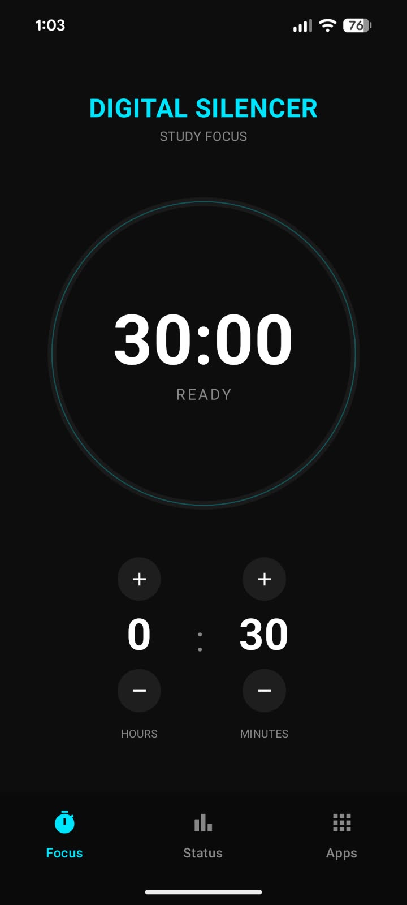
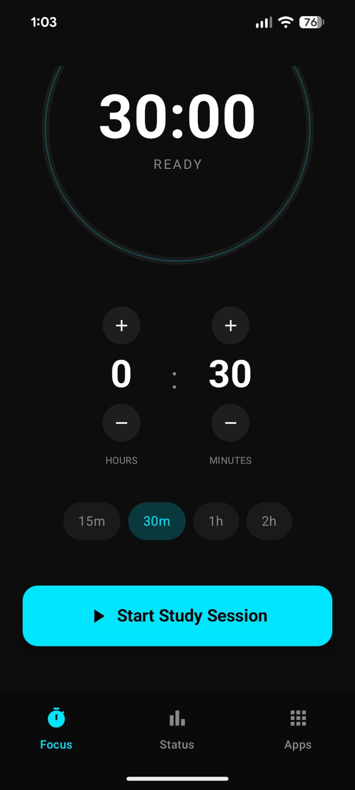
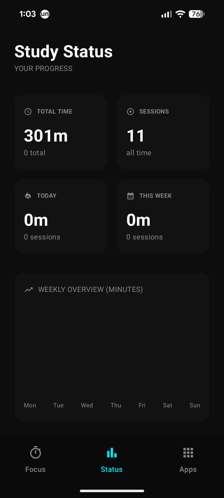

# Automatic Digital Silencer – Study Focus App

Automatic Digital Silencer is an Android application designed to help students reduce digital distractions during study sessions. The app identifies frequently used apps, allows users to select distracting apps, and temporarily restricts access to them during a study session.

## Features

- **Start Study Session:** Begin a focused study session and activate app restrictions.
- **Automatic App Selection:** Apps used for more than 10 minutes during the day are automatically selected for restriction.
- **Custom App Selection:** Users can manually enable or disable apps before starting a study session.
- **Distraction Blocking:** Restricted apps display a study-time screen when the user attempts to open them during a session.
- **Notification Blocking:** Disables notifications from distracting apps during the study session to minimize interruptions.
- **Emergency Bypass:** Temporarily bypass app restrictions for 5 or 10 minutes when necessary.
- **Automatic Restriction:** App restrictions are automatically restored after the bypass period ends.
- **Usage Statistics:** View app usage and study-related statistics through the Statistics section.

## How It Works

1. The user opens Automatic Digital Silencer and starts a study session.
2. The application identifies apps that have been used for more than 10 minutes that day.
3. These apps are automatically selected for restriction.
4. The user can customize the selected apps before starting the session.
5. During the session, restricted apps cannot be accessed normally.
6. If the user opens a restricted app, a study-time screen is displayed.
7. Notifications from selected distracting apps are also disabled during the session.
8. An emergency bypass can be activated for a limited period when required.
9. Once the bypass period ends, the restriction is automatically applied again.
10. Usage and study information can be viewed through the Statistics section.

## Technologies Used

- Kotlin
- Android Studio
- Android SDK

## Screenshots

### Home Screen

### Manage Apps

### Start Session

### Emergency Bypass

### Stop Session

### Statistics

## Purpose

Automatic Digital Silencer was developed to help students maintain focus during study sessions by reducing access to frequently used distracting applications and minimizing interruptions while still providing flexibility for emergency access.

## Future Enhancements

- Detailed study-time reports
- Weekly and monthly usage summaries
- Customizable session durations
- Improved focus and productivity tracking

## Author

**Khadeeja Jasla**

B.Tech Computer Science & Engineering
